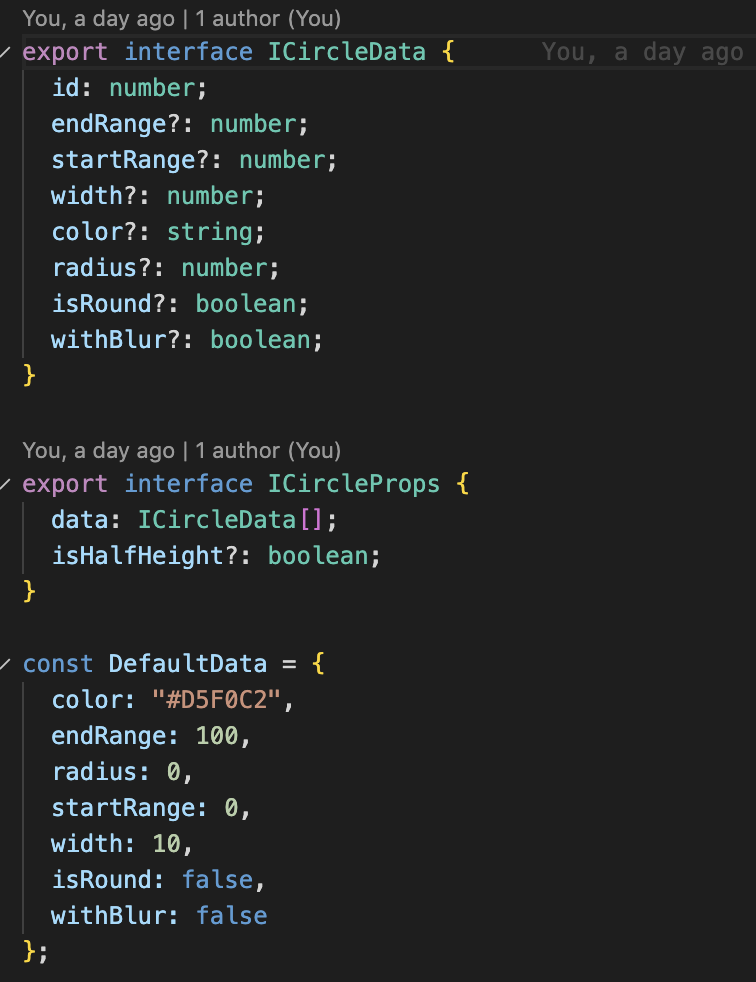
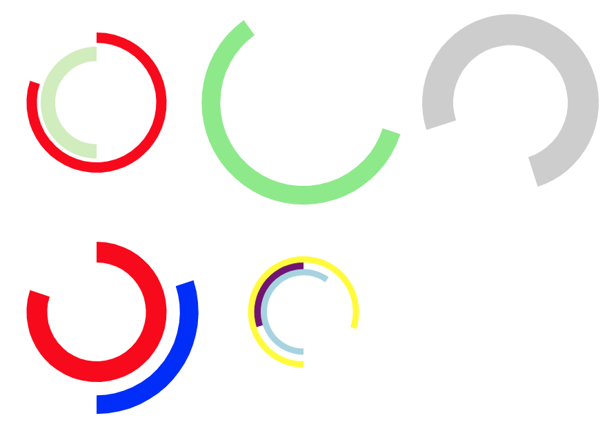

# svg-circle

typed library for creating svg circles

Example:

<Circle
data={[
{
id: 2,
endRange: 90,
startRange: 30,
width: 9,
color: "lightgreen"
},
{
id: 1,
endRange: 85,
startRange: 20,
width: 4,
color: "blue"
}
]}
/>

Some examples:

